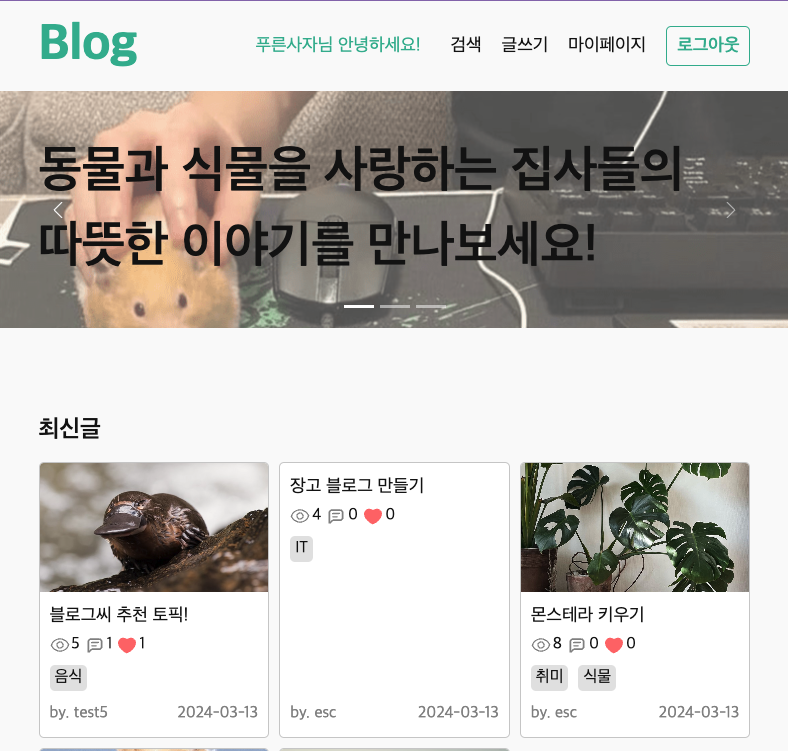
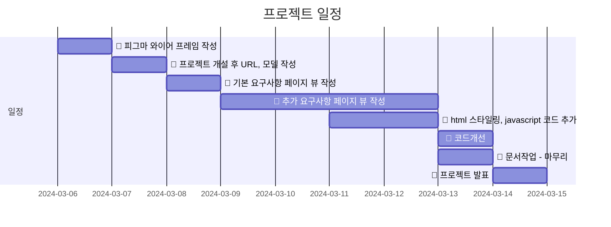
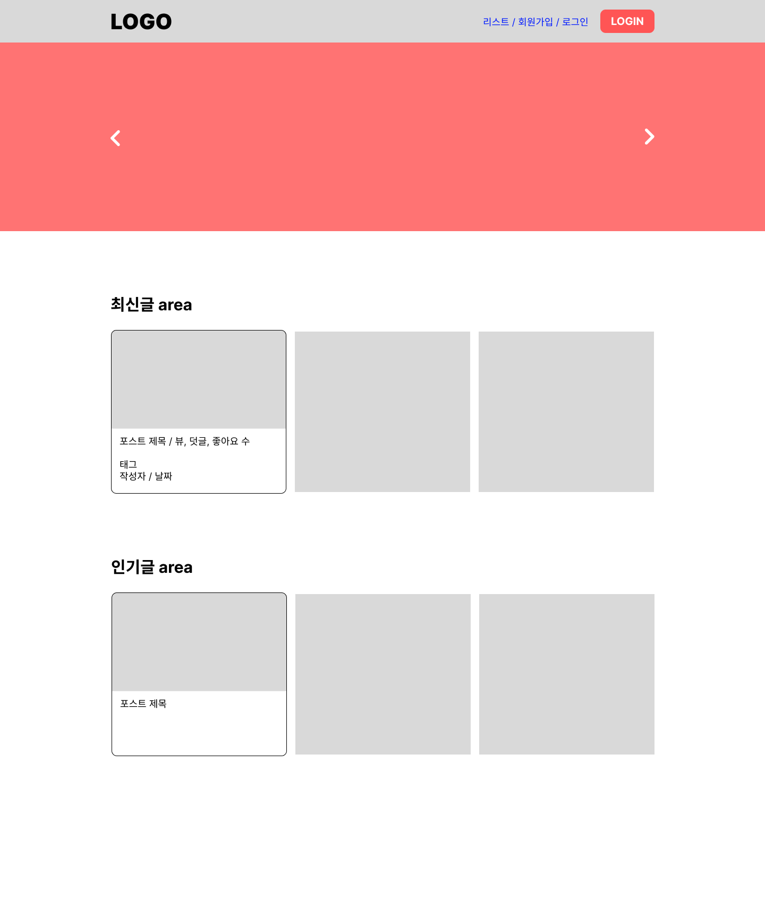
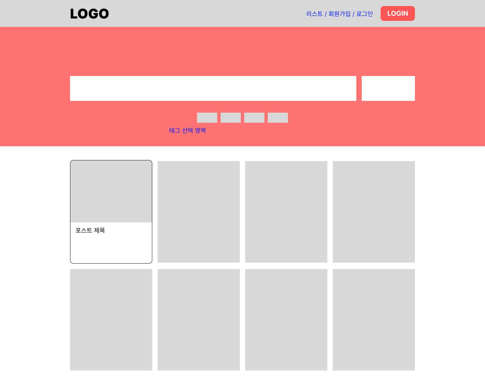
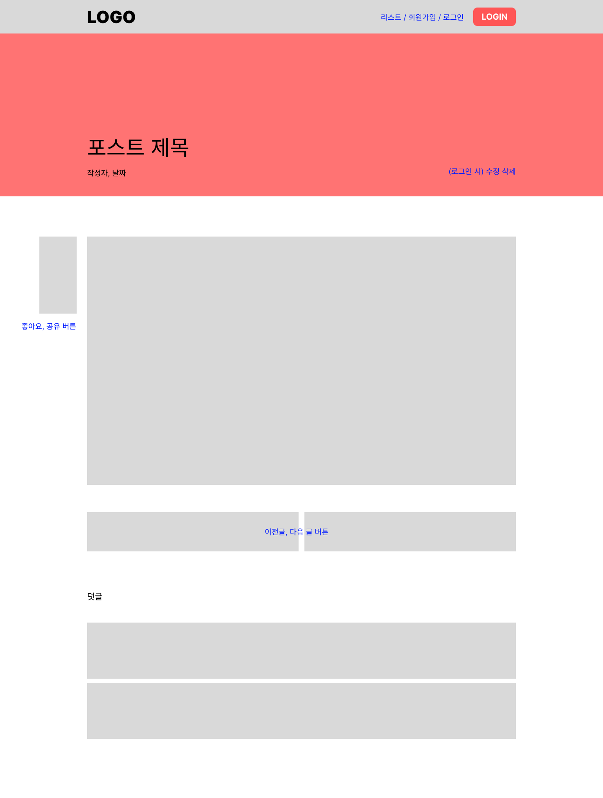
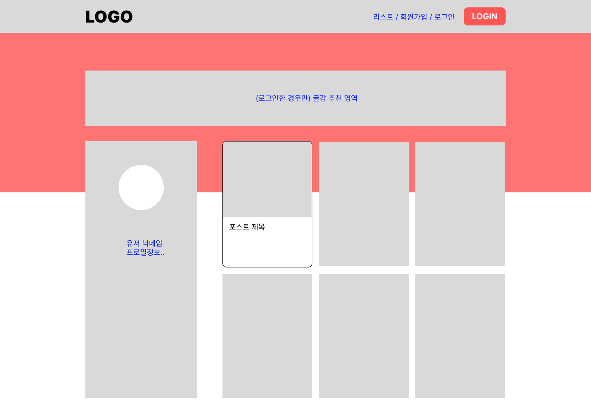
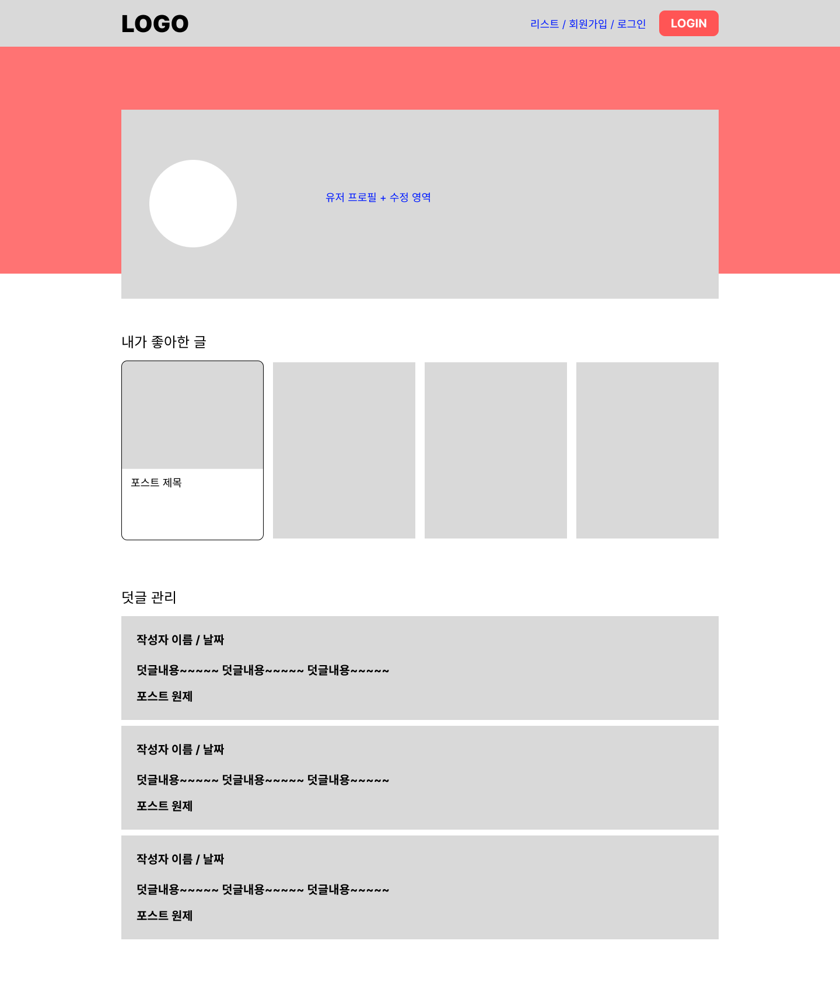
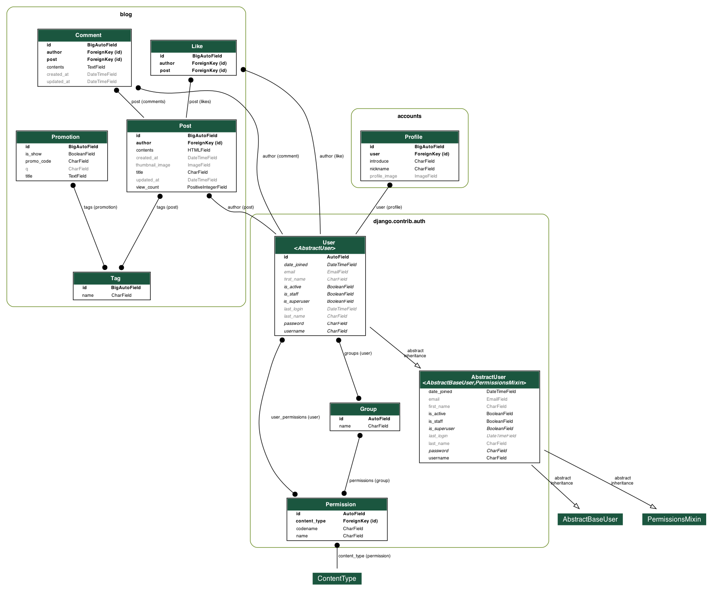
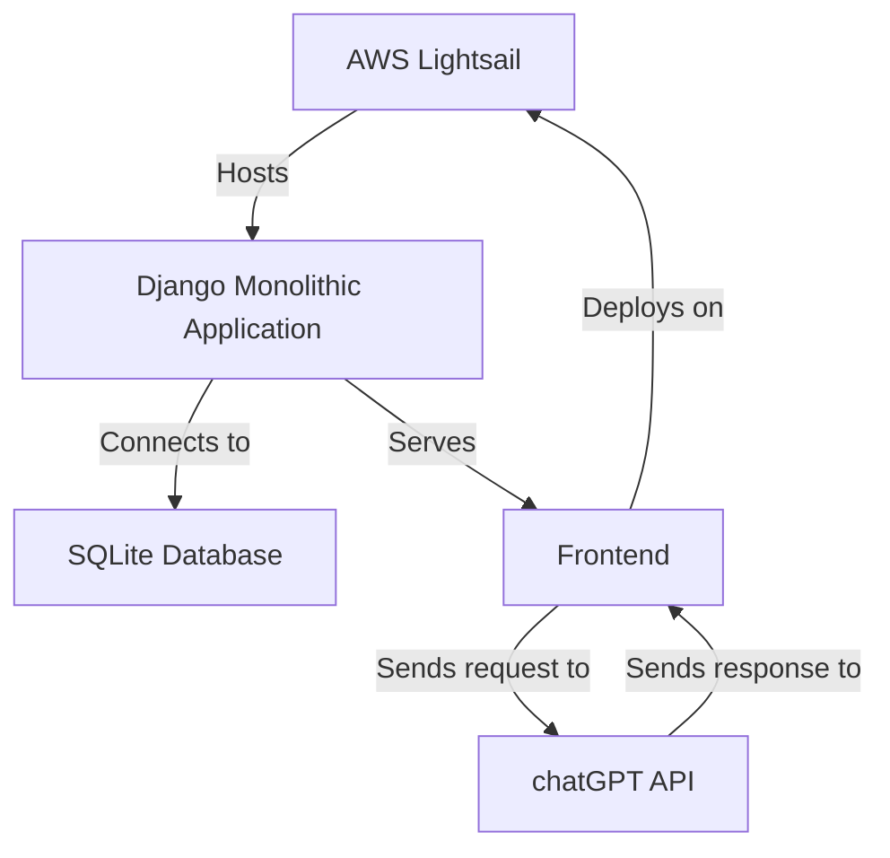

# Django Blog 📝


## 1. 목표와 기능
### 1.1. 목표
- 장고를 이용한 모놀리식 블로그 제작
- CRUD 및 회원가입을 CBV로 구현해 학습 내용 체화

### 1.2. 기능
- 회원가입 및 블로그 개설
- 위지윅 에디터를 이용한 블로그 포스팅 작성
- 포스트 좋아요와 조회수 카운트, 댓글 작성
- 태그를 통한 카테고리별 포스트 정렬
- chatGPT API를 통한 블로그 글감 추천

## 2. 개발환경 및 배포 URL
### 2.1. 개발 환경
- 개발 환경 : Django
- 서비스 배포 환경 : AWS Lightsail

### 2.2. 배포 URL
- http://3.34.193.222:8000/

### 2.3. URL 구조
- blog

| App | URL | Views Function | HTML File Name | Note |
| --- | --- | --- | --- | --- |
| blog | '/’ | main | blog/index.html | 메인 화면 |
| blog | 'posts/’ | post_list | blog/post_list.html | 검색 화면 |
| blog | 'post/<int:pk>/’ | post_detail | blog/post_detail.html | 포스트 상세보기 |
| blog | 'post/create/’ | post_create | blog/post_form.html | 포스트 생성 |
| blog | 'post/update/<int:pk>/’ | post_update | blog/post_form.html | 포스트 수정 |
| blog | 'post/delete/<int:pk>/’ | post_delete |  | 포스트 삭제 |
| blog | 'post/update_comment/<int:pk>/’ | comment_update |  | 덧글 수정 |
| blog | 'post/delete_comment/<int:pk>/’ | comment_delete |  | 덧글 삭제 |
| blog | 'post/like/<int:pk>/’ | post_like |  | 좋아요 토글 |

- accounts

| App | URL | Views Function | HTML File Name | Note |
| --- | --- | --- | --- | --- |
| accounts | 'accounts/signup/’ | signup | accounts/accounts_form.html | 회원가입 |
| accounts | 'accounts/login/’ | login | accounts/accounts_form.html | 로그인 |
| accounts | 'accounts/logout/’ | logout |  | 로그아웃 |
| accounts | 'accounts/mypage/’ | mypage | accounts/mypage.html | 로그인한 유저 상세정보+수정 |
| accounts | '<str:username>/’ | userhome | accounts/userhome.html | 해당유저 프로필, 포스팅 모아보기 |

## 3. 요구사항
1. **메인페이지 구현**
    - url : `/`
    - 페이지 제목과 블로그 입장하기 버튼이 있습니다.
    - 회원가입/로그인 버튼이 있습니다.
    - 회원가입 버튼을 클릭하면 회원가입 페이지로 이동합니다.
    - 로그인 버튼을 클릭하면 로그인 페이지로 이동합니다.
2. **회원가입 기능 구현**
    - url : `/register`
    - 회원가입을 할 수 있는 페이지가 있어야합니다.
    - 입력받는 값은 id, password입니다.
3. **로그인 기능 구현**
    - url : `/login`
    - 로그인을 할 수 있는 페이지가 있어야합니다.
    - 입력받는 값은 id, password입니다.
4. **게시글 작성 기능 구현**
    - **로그인을 한 유저만 해당 기능을 사용 할 수 있습니다.**
        - url : `/blog/write`
        - 게시글 제목과 내용을 작성 할 수 있는 페이지가 있어야합니다.
        - 작성한 게시글이 저장되어 게시글 목록에 보여야 합니다.
5. **게시글 목록 기능 구현**
    - url : `/blog`
    - **모든 사용자들이 게시한 블로그 게시글들의 제목을 확인 할 수 있습니다.**
6. 게시글 상세보기 기능 구현
    - url : `/blog/<int:id>` ex)`/blog/1, /blog/2,...`
    - 게시글의 제목/내용을 보는 기능입니다.
7. 게시글 검색 기능 구현
    - url : `/blog/search/<str:tag>`
    - 주제와 태그에 따라 검색이 가능하게 합니다.
    - 검색한 게시물은 시간순에 따라 정렬이 가능해야 합니다.
8. **게시글 수정 기능 구현**
    - **로그인을 한 유저만 해당 기능을 사용 할 수 있습니다.**
    - **본인의 게시글이 아니라면 수정이 불가능합니다.**
    - url : `/blog/edit/<int:id>`
    - 게시글의 제목 또는 내용을 수정 하는 기능입니다.
    - 게시글 제목과 내용을 수정 할 수 있는 페이지가 있어야합니다.
    - 수정된 내용은 게시글 목록보기/상세보기에 반영되어야합니다.
9. **게시글 삭제 기능 구현**
    - **로그인을 한 유저만 해당 기능을 사용 할 수 있습니다.**
    - **본인의 게시글이 아니라면 삭제가 불가능합니다.**
    - url : `/blog/delete/<int:id>`
    - 게시글을 삭제하는 기능입니다.
    - 삭제를 완료한 이후에 게시글 목록 화면으로 돌아갑니다.
    - **삭제된 게시글은 게시글 목록보기/상세보기에서 접근이 불가능하며,
    접근 시도 시 <존재하지 않는 게시글입니다> 라는 페이지를 보여줍니다.**

## 4. 프로젝트 구조와 개발 일정
### 4.1. 프로젝트 구조
```bash
📦blog_monoli
 ┣ 📂accounts
 ┃ ┣ 📂migrations
 ┃ ┣ 📜__init__.py
 ┃ ┣ 📜admin.py
 ┃ ┣ 📜apps.py
 ┃ ┣ 📜context_processors.py
 ┃ ┣ 📜models.py
 ┃ ┣ 📜tests.py
 ┃ ┣ 📜urls.py
 ┃ ┗ 📜views.py
 ┣ 📂blog
 ┃ ┣ 📂migrations
 ┃ ┣ 📂templatetags
 ┃ ┃ ┣ 📜__init__.py
 ┃ ┃ ┗ 📜blog_tags.py
 ┃ ┣ 📜__init__.py
 ┃ ┣ 📜admin.py
 ┃ ┣ 📜apps.py
 ┃ ┣ 📜forms.py
 ┃ ┣ 📜models.py
 ┃ ┣ 📜tests.py
 ┃ ┣ 📜urls.py
 ┃ ┗ 📜views.py
 ┣ 📂blog_monoli
 ┃ ┣ 📜__init__.py
 ┃ ┣ 📜asgi.py
 ┃ ┣ 📜settings.py
 ┃ ┣ 📜urls.py
 ┃ ┗ 📜wsgi.py
 ┣ 📂media
 ┃ ┣ 📂post
 ┃ ┃ ┗ 📂thumbnails/%Y/%m/%d/
 ┃ ┣ 📂profile/%Y/%m/%d/
 ┃ ┗ 📂readme
 ┣ 📂static
 ┃ ┣ 📂assets
 ┃ ┃ ┣ 📂banner
 ┃ ┃ ┗ 📜...
 ┃ ┣ 📂style
 ┃ ┃ ┣ 📜bootstrap.css
 ┃ ┃ ┣ 📜common.css
 ┃ ┃ ┗ 📜reset.css
 ┣ 📂templates
 ┃ ┣ 📂accounts
 ┃ ┃ ┣ 📜accounts_form.html
 ┃ ┃ ┣ 📜change_form.html
 ┃ ┃ ┣ 📜mypage.html
 ┃ ┃ ┗ 📜userhome.html
 ┃ ┣ 📂base
 ┃ ┃ ┣ 📜base.html
 ┃ ┃ ┣ 📜footer.html
 ┃ ┃ ┗ 📜header.html
 ┃ ┣ 📂blog
 ┃ ┃ ┣ 📜index.html
 ┃ ┃ ┣ 📜post_detail.html
 ┃ ┃ ┣ 📜post_form.html
 ┃ ┃ ┗ 📜post_list.html
 ┃ ┗ 📜404.html
 ┣ 📂venv
 ┣ 📜README.md
 ┣ 📜db.sqlite3
 ┣ 📜manage.py
 ┗ 📜requirements.txt
```

### 4.2. 개발 일정(WBS)


## 5. 와이어프레임 / 화면설계
- 메인 페이지


- 검색 화면


- 포스팅 상세


- 유저 홈


- 마이페이지



## 6.데이터베이스 모델링(ERD)


## 7.Architecture


## 8. 메인 기능

```mermaid
sequenceDiagram
    participant User
    participant Frontend
    participant ChatGPT API
    participant Backend
    

    User->>Frontend: userhome 페이지에 진입
    Frontend->>ChatGPT API: request.user == author인 경우 chatGPT API 요청 전송
    ChatGPT API-->>Frontend: chatGPT API 응답값 수신
    Frontend-->>User: recommend-area의 <textarea>에 응답값 삽입해 노출
    User->>Frontend: recommend-area의 '글 쓰러가기' 버튼 클릭
    Frontend->>Backend: post_create 페이지로 요청과 함께 <textarea> 값 전송
    Backend-->>Frontend: request.POST.recommend로 받아온 값을 id_contents 필드에 삽입
    User->>Frontend: 포스트 작성 완료 버튼 클릭
    Frontend->>Backend: 포스트 작성 내용 DB에 등록

```


## 9. 에러와 에러 해결
1. tag 필터를 쿼리스트링으로 여러개 받는 경우
    - 선택된 태그는 checked 표시를 해주고 싶었음.
    - 주소가 `/posts/?q=&tag=태그1&tag=태그2` 식으로 와서 request.GET.tag로 받는 경우 맨 마지막 태그만 checked 표시 됨
    - tag를 리스트로 받아올 필요성 느낌 + 해당 작업 커스텀 템플릿 태그로 수행 가능함을 인식
    - request.GET.getlist로 태그를 리스트로 파싱해주는 템플릿 태그 추가해 해결
2. Profile 모델의 자기소개 디폴트 값 지정
    - 모델에 필드를 지정할 때 f"안녕하세요! {user.username}입니다"와 같은 f스트링 방식으로는 제대로 작동하지 않음.(<django.db.models.query_utils.DeferredAttribute object at 0x110259910>)
    - default 값은 비워두고 save 메서드를 오버라이드해서 객체가 저장되는 시점에 기본값을 삽입하도록 수정
3. update 화면에서 form에 기존 포스트 value가 들어오지 않는 경우
    - 시간을 많이 소요했으나 아주 초보적인 실수. 수정하기 버튼을 POST인 form으로 만든 상태였음.
    - 수정하기 버튼은 굳이 토큰값을 넣어줄 필요가 없음. 링크로 이동해도 충분.

## 10. 개발하며 느낀점
1. 이것이.. 백엔드의 맛? 👀
    - 일단 뛰어들어 볼 수 있는 프론트 작업과 달리 백엔드는 중간중간 추가하며 작업하는게 적절하지 않다는 걸 체험함. 문서 작성과 설계가 왜 중요시 되는지 다시 한 번 느꼈다.
    - 웹 서비스를 이용할 때 어떤 데이터와 테이블이 있는지 역설계하는 연습이 필요하다고 생각. 데이터를 다루는 작업이니만큼 책임감이 중요하다고 느꼈음.
    - 최신 문서와 케이스가 귀했던 프론트에 비해 오래된 글도 아직 유효하게 적용되는 경우가 많아 서치는 상대적으로 수월했다.
    - 그러나 적용은 그리 쉽지 않았다. 그러나 사정사정 해서 받아오던 API와 인증 구현을 직접 만들 수 있어서 신났다!
2. 독서와 캠프활동의 보람 📚
    - 지난 프로젝트에서는 ChatGPT API 사용 시 프롬포트 엔지니어링에 많은 시간을 소요하고도 원하는 결과를 얻기가 힘들었음.
    - 오름캠프 이벤트로 관련 서적을 받을 기회가 있었는데, 이번엔 확실히 프롬포트 작성 시간을 줄이고 정확도를 높일 수 있어서 만족스러웠다.